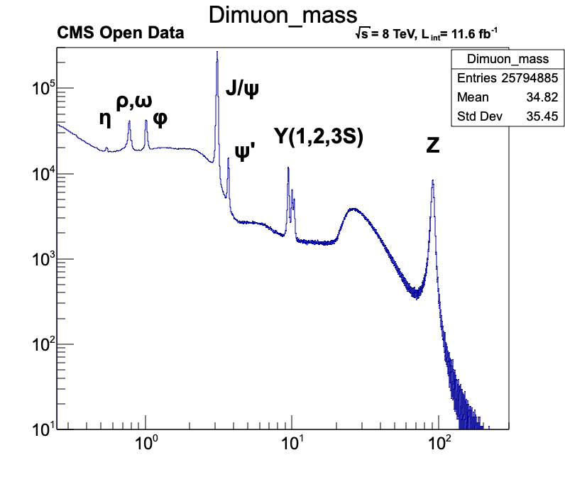

# Notebooks to accompany the seminar about RooFit

## RooFit101Demo.ipynb
Demonstrate basic RooFit functionality.

## CreateCMSDatasetWithRDF.ipynb
RDataFrame analysis demo, which creates a RooFit dataset of dimuon events from CMS open data.

## FitCMSDataset.ipynb
Fit the Z peak in the above dataset using a Bukin function and a background model of Bernstein polynomials.

## HiggsCombinationDemo.ipynb
Show how to combine two likelihood functions that have been saved into files. This uses very simple toy models, but it shows how a large combination of measurements can work in principle.

